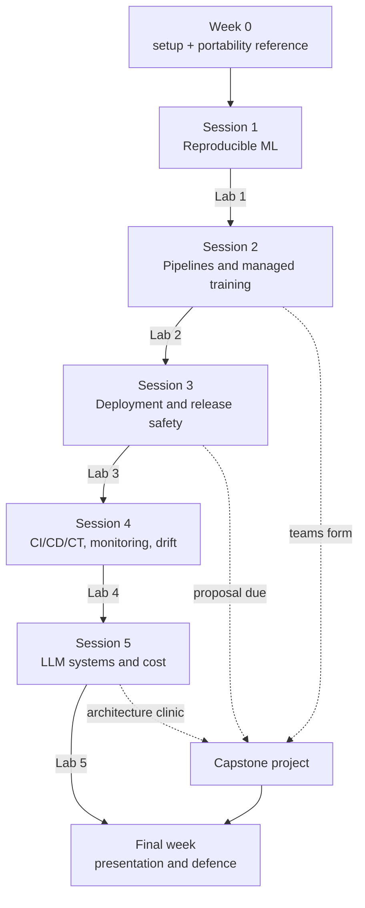

# ITCS355 — Course Materials

Everything a student needs to read, in one place. The code they run lives one level up, in
the repository root.

**ITCS355 Machine Learning Operation and Deployment** · 1(1-0-2) · Faculty of ICT, Mahidol
University · 5 sessions × 3 hours + final week

---

## Read in this order

0. **Week 0 setup, step by step.** Pick **one** provider and stay on it for the term:
   **[`getting-started-gcp.md`](getting-started-gcp.md)** (cheaper registry; the free trial
   wants a credit card) or **[`getting-started-azure.md`](getting-started-azure.md)** (credit
   from your university email, no card; the registry bills daily). Either takes you from an
   empty laptop to a finished Lab 1, and both assume minimum access — one subscription or
   project, basic permissions, a small budget.
1. **[`reference/cloud-portability-reference.md`](reference/cloud-portability-reference.md)**
   — before anything else. Defines the contract that makes every lab work on AWS, Azure, or
   GCP, and contains the Week 0 setup checklist.
2. **[`../README.md`](../README.md)** — the repository you will actually work in.
   Deeper detail in [`../docs/REPO-GUIDE.md`](../docs/REPO-GUIDE.md).
3. Your current lab handout, from `labs/`.
4. **[`project/project-brief.md`](project/project-brief.md)** — read it after Session 2, not
   in the final week.




---

## Session map

| Session | Topic | CLO | Handout | Code you touch |
|---|---|---|---|---|
| 1 | From Notebook to Reproducible ML | CLO1 | [Lab 1](labs/lab-01-reproducible-training.md) | `src/train.py`, `Dockerfile`, `tests/test_data.py` |
| 2 | Pipelines, features, and managed training | CLO1 | [Lab 2](labs/lab-02-tracking-and-registry.md) | `src/tune.py`, `src/costs.py`, `scripts/compare_runs.py` |
| 3 | Deployment, scaling, and release safety | CLO2, CLO3 | [Lab 3](labs/lab-03-serving-and-rollback.md) | `service/`, `loadtest/` |
| 4 | CI/CD/CT, monitoring, and drift | CLO2, CLO3 | [Lab 4](labs/lab-04-cicd-monitoring-drift.md) | `.github/workflows/`, `monitoring/` |
| 5 | Operating LLM systems and defending the bill | CLO2, CLO3 | [Lab 5](labs/lab-05-cloud-mlops-and-cost.md) | `pipeline/`, `cloudlayer/pipelines.py` |
| Final | Presentations and defence | All | [Project brief](project/project-brief.md) | everything |

---

## Assessment at a glance

| Component | Marks | CLO1 / CLO2 / CLO3 |
|---|---|---|
| Capstone demo & defense | 15 | 5 / 5 / 5 |
| Capstone System | 30 | 10 / 10 / 10 |
| In-class drills (5 × 3) | 15 | 5 / 5 / 5 |
| Labs (5 × 8) | 40 | 15 / 15 / 10 |
| **Total** | **100** | **35 / 35 / 30** |

**There is no final examination.** The capstone is worth 45 across two lines: the five rubric
criteria score 30 as **Capstone System**, and the live demo and defence scores 15 as
**Capstone demo & defense**.

**Labs are marked directly**, 8 marks each, against the acceptance criteria in each handout.
A lab either meets them or it does not — there is no partial credit for a service that almost
deploys. At 40 marks the labs are the single largest component: this course is graded on what
you build and operate, not on what you can recall.

**In-class drills** run at the start of each session, 3 marks each. They carry evidence
questions drawn from your own lab output: your p95 figure, your run ID, the true cause behind
your drift alert. So a copied lab earns nothing in the drill. The labs also compound, which
means skipping Lab 1 makes Lab 3 impossible.

**Model accuracy is not graded anywhere.** A 0.71 AUC model with clean lineage, a working
rollback, and an honest cost report outscores a 0.94 model that only runs on its author's
laptop.

Full allocation is on the **Assessment Blueprint** sheet —
readable as [`spec/course-specification.md`](spec/course-specification.md), authoritative as
[`spec/Course_Specification_ITCS355_merged.xlsx`](spec/Course_Specification_ITCS355_merged.xlsx).

---

## Contents

```
course/
├── spec/       Faculty course specification. Course_Specification_691_ITCSB_ITCS355.xlsx
│               is the file issued by the university system, kept unmodified for
│               provenance. The *_merged.xlsx is that file's seven sheets plus four
│               course-design sheets, and is what scripts/export_spec_md.py turns into
│               the .md that renders on GitHub.
├── slides/     course-deck.md is the course overview; session-01..05.md are the
│               teaching decks for each session. All render on GitHub and build to
│               slides or PDF with Marp. ITCS355-course-deck.html is a separately
│               styled rendering of the overview only.
├── reference/  The cloud portability contract. Read first.
├── getting-started-gcp.md
├── getting-started-azure.md
│               Week 0 and Week 1, step by step. Do one, not both.
├── labs/       Five take-home lab handouts.
└── project/    Capstone brief, milestones, and rubric.
```

---

## Cloud platform

The labs are written provider-neutral and work on **AWS, Azure, or GCP**. You pick one in
Week 0 and stay on it. Your choice does not affect your marks: the grader only ever calls
the neutral interface defined in the portability reference.

Target spend for the term is under 800 THB. Every lab ends with a teardown step, and
teardown is checked.
