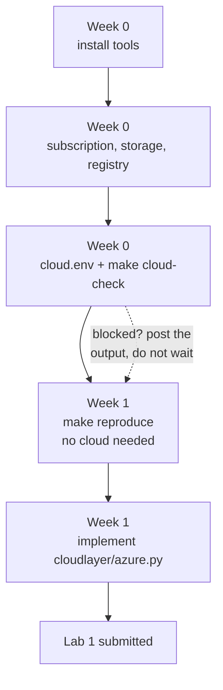

# ITCS355 — Getting Started on Azure (Week 0 and Week 1)

The Azure path through Week 0. Its sibling is
[`getting-started-gcp.md`](getting-started-gcp.md) — do **one** of them, not both, and stay on
the provider you pick for the whole term.

> **Read [`reference/cloud-portability-reference.md`](reference/cloud-portability-reference.md)
> alongside this.** It explains *why* the repository is shaped the way it is. This guide is the
> *how*, in order, with the commands.

**Time:** about 90 minutes for Week 0, about 4 hours for Lab 1.



## Why you might pick Azure

**Azure for Students gives you credit without a credit card.** It verifies your academic status
from your university email and issues credit valid for twelve months. If you have no card, or
you would rather not put a personal card behind a course exercise, this is the path with the
fewest obstacles.

Two catches, and the second is the one that shapes how you do Labs 3 and 5.

**Azure Container Registry bills a flat daily rate** — roughly USD 0.17 a day on the Basic tier —
whether you push anything or not. GCP's Artifact Registry charges for what you store instead. Over
a term the difference is real but comfortably inside your student credit, provided you **delete the
registry when the course ends**. On Azure, teardown is not a formality.

## The vCPU ceiling — read this before Lab 3

**Azure for Students caps you at about 3 vCPU per region, and the cap cannot be raised.**

Free subscriptions are not eligible for quota increases. The request is refused by design, and the
only way past it is converting to Pay-As-You-Go, which means attaching a credit card — the exact
thing this path exists to avoid. Some student subscriptions show quota **0** for certain families,
D-series especially.

Two consequences you need to plan around:

| | |
|---|---|
| **VM sizes** | Use **B-series burstable**: `Standard_B1s` (1 vCPU) or `Standard_B2s` (2 vCPU). A 4-vCPU size such as `Standard_DS3_v2` will not deploy. |
| **Azure ML managed online endpoints** | Effectively unavailable. They reserve 20% for upgrades, so the quota needed is `ceil(1.2 x instances) x cores` — one `Standard_DS3_v2` instance asks for **8 vCPU** against a cap of 3. Even a 2-core size asks for 4. |

**So Lab 3 does not deploy to an Azure ML managed endpoint.** Deploy your container to **Azure
Container Apps** instead: consumption pricing, scales to zero, no Azure ML core quota involved, and
a monthly free grant that covers this course comfortably. The lab asks for a deployed inference
endpoint — it does not require it to be an Azure ML one.

```bash
az containerapp up --name itcs355-predict --resource-group $RG \
  --image $ACR.azurecr.io/itcs355/serve:<sha> --target-port 8080 --ingress external
```

This is not a workaround to be embarrassed about. Choosing the service that fits your constraints,
and being able to say what the constraint was, is the whole subject.

---

## Before you start

| | What | How to check |
|---|---|---|
| 1 | Python 3.11 or newer | `python3 --version` |
| 2 | Docker, running | `docker run hello-world` |
| 3 | Git | `git --version` |
| 4 | An Azure subscription with credit | §2 below |

On Windows, use WSL2 and run everything in the Linux shell — the Makefile assumes bash.

---

# Week 0

## 1. Install the Azure CLI

```bash
curl -sL https://aka.ms/InstallAzureCLIDeb | sudo bash   # Debian / Ubuntu / WSL
brew install azure-cli                                    # macOS
az version
```

## 2. Get a subscription

Go to **https://azure.microsoft.com/free/students** and sign in **with your university email**.

Azure for Students verifies academic status from the address and issues credit with **no credit
card required**. If your university address is not recognised automatically, the sign-up offers
document-based verification instead — use it rather than switching to a personal address, because
the credit is tied to academic status.

**If verification fails**, stop and tell me. Do not fall back to a paid personal subscription.

Then:

```bash
az login
az account show
az account list --output table
```

`az account show` must print your subscription. If it prints nothing, the login did not complete.

```bash
export SUBSCRIPTION=$(az account show --query id -o tsv)
az account set --subscription "$SUBSCRIPTION"
```

## 3. Create your resource group

Everything you create goes in one resource group, which is also how you delete everything later
in one command. Use **Southeast Asia** (Singapore) unless you have a reason not to — it is the
closest region to Bangkok and keeps Lab 3's latency numbers honest.

```bash
export REGION=southeastasia
export RG=itcs355-<studentid>

az group create --name $RG --location $REGION \
  --tags course=itcs355 student=<studentid>
```

Those tags are not decoration. `make teardown` finds resources by tag from Lab 3 onward, and
Lab 5 grades whether teardown actually worked.

## 4. Create storage and a container registry

Storage account names are **globally unique, lowercase, 3–24 characters, letters and digits
only** — no hyphens. Registry names have the same rule. Put your student ID in both.

```bash
export SA=itcs355<studentid>          # no hyphens, lowercase
export ACR=itcs355<studentid>

az storage account create --name $SA --resource-group $RG \
  --location $REGION --sku Standard_LRS --kind StorageV2 \
  --tags course=itcs355

az storage container create --name itcs355 \
  --account-name $SA --auth-mode login

az acr create --name $ACR --resource-group $RG \
  --sku Basic --location $REGION --tags course=itcs355
```

Verify:

```bash
az storage account show --name $SA --query name -o tsv
az acr show --name $ACR --query loginServer -o tsv
```

## 5. Two separate logins — this trips up almost everyone

`az login` authenticates **you, at the terminal**. It does not authenticate **docker**, and the
Python SDK reaches your identity through a separate mechanism.

```bash
# so docker may push to your registry
az acr login --name $ACR
```

The Python side uses `DefaultAzureCredential`, which picks up your `az login` session locally and
a managed identity in CI. That is why the adapter uses it rather than a connection string — a
connection string is a secret you would then have to keep out of Git, and Lab 4 needs the CI path
to work anyway.

Give yourself data-plane access to the blobs. Owning the subscription is not the same as being
allowed to read the data inside it:

```bash
az role assignment create \
  --role "Storage Blob Data Contributor" \
  --assignee $(az ad signed-in-user show --query id -o tsv) \
  --scope $(az storage account show --name $SA --resource-group $RG --query id -o tsv)
```

Skipping that produces `AuthorizationPermissionMismatch` on your first upload, which reads like a
code bug and is not one.

## 6. Get the repository and write `cloud.env`

```bash
git clone <course-repo-url> && cd <repo>
cp cloud.env.example cloud.env
```

`cloud.env` holds your account identifiers. It is gitignored and **must stay that way** —
committing it is an automatic deduction on the capstone.

```bash
CLOUD_PROVIDER=azure
PROJECT_ID=itcs355-<studentid>
REGION=southeastasia

BLOB_URI=https://itcs355<studentid>.blob.core.windows.net/itcs355/itcs355
CONTAINER_REGISTRY=itcs355<studentid>.azurecr.io/itcs355

MLFLOW_TRACKING_URI=sqlite:///mlflow.db

MODEL_REGISTRY_NAME=itcs355-<studentid>
IDENTITY_REF=<your az login account, from `az account show --query user.name -o tsv`>

BUDGET_LIMIT_THB=800
```

Two notes:

- **`BLOB_URI`** is `https://<account>.blob.core.windows.net/<container>/<prefix>`. The account
  and the container are different things and both appear in the URI; getting them the wrong way
  round is the classic first failure here.
- **`IDENTITY_REF` must not be empty.** `make cloud-check` fails any slot that resolves to an
  empty string, and all eight are required. In Lab 1 you run as yourself.

## 7. Verify

```bash
make setup          # installs pinned dependencies; ends with "environment ok"
make cloud-check    # eight capability slots plus CLI, credentials, docker
```

Every line should say PASS.

**Post this output in the course channel before Session 1** — even if lines say FAIL. That is
what it is for. A FAIL posted on Sunday is a five-minute problem; the same FAIL found in the room
is a lost session.

## 8. Set a budget alert now, not later

The term target is **under 800 THB**. Lab 1 costs almost nothing; the expensive mistakes come
later, and always from something left running.

```bash
az consumption budget create --budget-name itcs355 --amount 25 \
  --category Cost --time-grain Monthly \
  --start-date $(date +%Y-%m-01) --end-date $(date -v+1y +%Y-%m-01 2>/dev/null || date -d '+1 year' +%Y-%m-01)
```

If that command is awkward on your subscription, set it in the portal instead: **Cost Management
→ Budgets → Add**. Either way, do it before you create anything else.

Everything you made lives in one resource group, so the end-of-term cleanup is one command:

```bash
az group delete --name $RG --yes          # deletes storage, registry, everything
```

**Do this when the course ends.** The registry bills daily whether you use it or not.

---

# Week 1 — Lab 1

Full handout: [`labs/lab-01-reproducible-training.md`](labs/lab-01-reproducible-training.md).

## The part that needs no cloud at all

This is deliberate, and it is the point of the lab. `make reproduce` runs entirely on your
machine, in Docker, with no credentials. That is exactly why a grader can run it.

```bash
make data        # generate the dataset, deterministically
make test        # data contract and split property tests
make train       # train locally, outside the container
make reproduce   # THE ONE COMMAND — the grader runs this and nothing else
make verify      # compare the produced metric against the claim in README.md
```

**If you are stuck on Azure access, do this part anyway.** It is most of the lab, and it is the
half graded by a script.

### On Apple Silicon

`make image` builds for `linux/amd64` so the image matches CI and the grader. Under emulation
that is slow — several minutes is normal, not a hang.

## The Azure part

Lab 1 asks you to implement three of the eleven adapter methods in
[`cloudlayer/azure.py`](../cloudlayer/azure.py): `upload`, `download`, and `push_image`.

```bash
pip install azure-storage-blob azure-identity
```

The file's docstring carries the specific hints. The rules that matter:

- **Parse the blob URI inside the adapter, never in `src/`.** `make portability-audit` fails the
  build if `blob.core.windows.net`, `abfss://`, or an Azure SDK import appears in `src/`,
  `service/`, `monitoring/`, or `tests/`. That is Layer 1, and it stays provider-neutral.
- **Use `DefaultAzureCredential`, not a connection string.** A connection string is a secret in
  your environment; the credential chain is not, and it is what makes Lab 4's CI path work.
- **`push_image` must return the digest reference**, `registry.azurecr.io/repo@sha256:...`, not
  the tag. A tag can be moved to point at different bytes; a digest cannot. During an incident,
  "which code is serving?" has to have one answer.
- **Azure tags live on the resource, not the blob.** Tag the storage account and the registry
  with `cfg.tags(1)` — you did this at creation time in §3 and §4.

Check your work:

```bash
make portability-audit
make image
make image-push
```

## Common failures, in the order you will hit them

| Symptom | Cause |
|---|---|
| `AuthorizationPermissionMismatch` on upload | No **Storage Blob Data Contributor** role — owning the subscription is not data-plane access (§5) |
| `unauthorized: authentication required` on push | You skipped `az acr login` (§5) |
| Storage account create fails, name invalid | Names are lowercase alphanumeric, 3–24 chars, **no hyphens** |
| Storage account create fails, name taken | Names are globally unique — add your student ID |
| `make cloud-check` fails on `credentials` | `az account show` returns nothing; re-run `az login` |
| `make cloud-check` fails on one slot reading `unset` | All eight slots must be non-empty, `IDENTITY_REF` included |
| Container and account swapped in `BLOB_URI` | The account is the hostname; the container is the first path segment |
| Portability audit fails after your adapter works | You put URI parsing in `src/` instead of `cloudlayer/` |
| Credit draining with nothing running | ACR Basic bills daily regardless of use — that is expected, and why teardown matters |

---

## What to have done before Session 2

- [ ] `make cloud-check` all green, output posted in the course channel
- [ ] Budget alert set
- [ ] `make reproduce` works from a **fresh clone**, not just your working directory
- [ ] The `expected test_roc_auc:` line in the root `README.md` re-measured and updated
- [ ] `cloudlayer/azure.py` implements `upload`, `download`, `push_image`
- [ ] `make portability-audit` passes
- [ ] `cloud.env` is **not** in `git status`

Lab 1 is worth 8 marks, awarded met-or-not-met: `make reproduce` works from a fresh clone on a
machine that is not yours, and the metric matches your claim. There is no partial credit for a
repository that almost reproduces — which sounds harsh and is kinder in practice, because it is
the same unambiguous standard for everyone.
