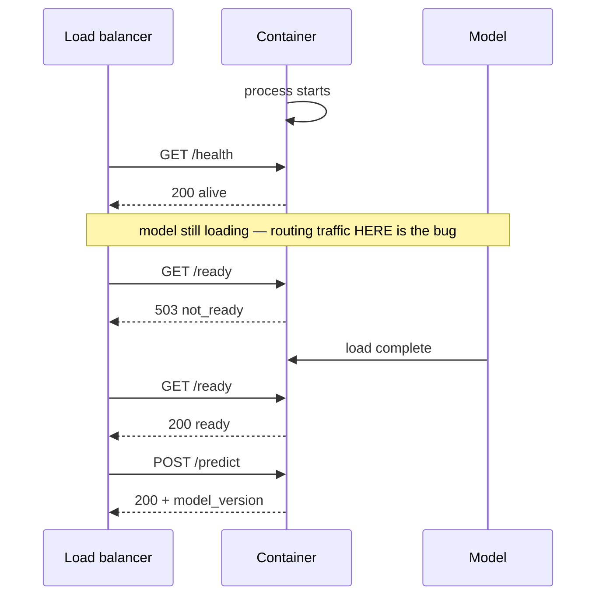

# ITCS355 — Lab 3: Serving, Load Testing, and Rollback

**Released:** end of Session 3 · **Due:** before Session 4 · **Effort:** ~5 hours
**CLO2, CLO3** · **Marks:** 8 · **Also assessed through:** Drill 3 and Capstone criterion R2 (Deployment & CI/CD)
**Cloud used:** container registry, model registry, managed endpoint, monitoring

> **Cost warning.** This is the first lab that creates a resource billed by the hour whether or not
> anyone calls it. Set a calendar reminder to run `make teardown` the moment you finish. Leaving an
> endpoint running over a weekend is the single most expensive mistake students make in this course.

**In this repository**

Files: `service/app.py` · `service/schemas.py` · `service/Dockerfile.serve` · `loadtest/k6.js` · `loadtest/locustfile.py` · `tests/test_service.py`

Commands: `make serve · make serve-image · make loadtest`

Every `TODO` marker in those files is a graded decision. Everything around them already works, so you debug your own choices rather than the scaffolding.

---

## Objective

Put your registered model behind an HTTP API, find out honestly how it behaves under load, and prove
you can take a bad version out of production quickly.

---

## Task 1 — Build the inference service (60 min)

A FastAPI service with four endpoints:

| Route | Purpose |
|---|---|
| `POST /predict` | Single prediction |
| `POST /predict/batch` | Up to 100 rows in one call |
| `GET /health` | Liveness — process is up |
| `GET /ready` | Readiness — model is loaded and can score |

`/health` and `/ready` are genuinely different, and confusing them causes a specific production
failure: traffic routed to a container whose model has not finished loading. Every managed endpoint
service on all three providers distinguishes them.



Requirements:
- Pydantic schemas for request and response; reject malformed input with 422 and a useful message
- The model is loaded **once at startup**, from the registry by version, never per request
- Structured JSON logs including a request ID, latency in milliseconds, and the model version
- The model version is returned in every response body

**Do not put provider code in the service.** It loads the model through your adapter. The same
container image must be deployable on any of the three providers.

## Task 2 — Deploy it (50 min)

> **On Azure for Students: do not use an Azure ML managed online endpoint.** They reserve 20% for
> upgrades, so the quota needed is `ceil(1.2 × instances) × cores` — one `Standard_DS3_v2` instance
> asks for 8 vCPU against a student cap of about 3, and **that cap cannot be raised**. Deploy to
> **Azure Container Apps** instead: no Azure ML core quota, scales to zero, and a free monthly
> grant. Use `Standard_B1s`/`B2s` for anything that needs a VM. Details in
> [`../getting-started-azure.md`](../getting-started-azure.md). This changes which service you
> deploy to, not what the lab asks for — you still need an endpoint, a load test, and a rollback.

Implement `deploy()` and `invoke()` in your adapter, then deploy.

```bash
make deploy          # adapter.deploy(model_ref, endpoint, instance)
make smoke           # adapter.invoke() with three known payloads
```

**Provider notes.** SageMaker real-time endpoints expect `/ping` and `/invocations` by default —
configure the paths rather than renaming your routes. Azure ML managed online endpoints use a scoring
script wrapper and expect a specific liveness route. Vertex AI endpoints require the health and
predict routes to be declared on the model resource. In all three cases the difference is
configuration, and it belongs in your adapter, not your `Dockerfile`.

If you deploy to a scale-to-zero service instead (Cloud Run, Container Apps, App Runner), you must
report cold-start latency separately in Task 3. It will dominate your p99.

## Task 3 — Load test honestly (75 min)

Use k6 or Locust. Commit the script — an uncommitted load test is not evidence.

Measure at **three concurrency levels** (suggested: 1, 10, 50) and report for each:

- throughput, requests per second
- **p50, p95, and p99** latency
- error rate
- if applicable, cold-start latency as a separate figure

Then find the breaking point: the concurrency at which your p95 crosses your stated target, or errors
appear. Report that number.

**State your latency target before you measure, not after.** A target chosen once the numbers are in
is not a target, and this is graded.

Then push on three variables and report what each does:

1. **Batch size** — does `/predict/batch` with 100 rows beat 100 calls to `/predict`? By how much?
2. **Payload size** — inflate the request and find where serialization starts to dominate
3. **Instance size** — one step up. Report the latency change *and* the cost change

## Task 4 — Canary and rollback (60 min)

Deploy a second, deliberately worse model version — worse by a small margin, not obviously broken.
Split traffic (start at 90/10) and:

1. Detect the degradation **from metrics alone**, without looking at which version is which
2. Record how long detection took
3. Roll back
4. Capture timestamped evidence that traffic actually moved

Write five lines answering: what metric revealed it, how long detection took, what would have made it
faster, and what would have happened at 50/50 instead of 90/10.

**Provider notes.** SageMaker uses production variants with weights; Azure ML uses traffic percentages
across deployments under one endpoint; Vertex AI uses traffic split across deployed models. Same
concept, three vocabularies.

## Task 5 — Cost per thousand predictions (25 min)

Compute it, showing your method: instance hourly rate, throughput achieved, and the assumed
utilisation. State the utilisation assumption explicitly — it is where the number is most fragile.

Then answer in two lines: at what request volume would batch inference be cheaper than keeping this
endpoint warm?

---

## Deliverables checklist

- [ ] FastAPI service with all four routes, schema validation, structured logs, version in response
- [ ] Model loaded once at startup from the registry by version
- [ ] `deploy()` and `invoke()` implemented; endpoint live and smoke-tested
- [ ] Committed load-test script
- [ ] `reports/lab3-load.md` — three concurrency levels, p50/p95/p99, throughput, error rate
- [ ] Stated latency target, the configuration that meets it, and the breaking concurrency
- [ ] Batch, payload, and instance-size findings with cost deltas
- [ ] Canary config, detection write-up, and timestamped rollback evidence
- [ ] Cost per 1,000 predictions with method and utilisation assumption
- [ ] **`make teardown` run and confirmed**

## Acceptance criteria

**Passes when** your endpoint meets your own stated p95 target at your stated concurrency, and your
rollback evidence shows traffic genuinely moved.

**Fails when** only mean latency is reported; the target was set after measuring; the rollback is
described but not evidenced; the endpoint is still running at grading time.

## Common failure modes

| Symptom | Cause |
|---|---|
| p99 far worse than p95, with a repeating pattern | Cold start on a scale-to-zero service, or model reload per request |
| Health check passes, traffic errors | `/health` used where `/ready` was needed |
| Load test shows a flat ceiling regardless of concurrency | The client is the bottleneck, not the service |
| Deployment succeeds, invocation returns 404 | Provider's expected route paths not configured |
| Cost far above estimate | The endpoint ran overnight while you wrote the report |

## Teardown

```bash
make teardown        # deletes endpoints, deployments, and compute tagged lab=3
make cost-report
```

Verify in the console afterwards. Teardown scripts fail silently more often than you would like, and
the bill is the thing that eventually tells you.

## What Drill 3 covers

Concepts: serving patterns, health versus readiness, latency percentiles, canary and rollback
mechanics. Evidence from your own work: your p95 at concurrency 10, your breaking concurrency, your
detection time in Task 4, and your cost per 1,000 predictions.
