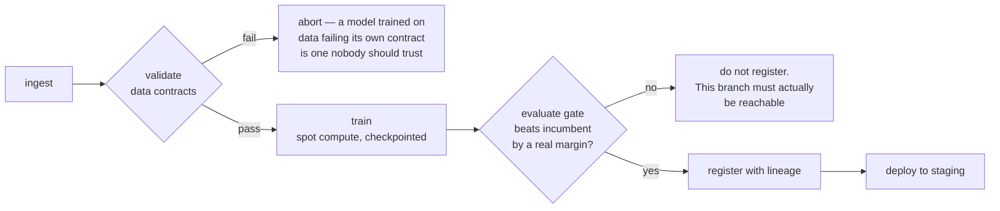

# ITCS355 — Lab 5: Operating LLM Systems and Defending the Bill

Two halves, and they are the same skill applied to two kinds of system.

**Part A — defending the bill.** Move the Lab 3 service onto a managed platform, lock its
identity down, prove the portability seam holds, and produce a cost report you could put in
front of someone who does not write code. Tasks 1 to 6.

**Part B — operating an LLM step.** Add a language-model step to the same system and make it
operable: an evaluation gate that can fail, a guardrail you can demonstrate, and a token bill
you can defend. Tasks 7 to 9.

Part B is newer than the rest of this course and shorter on purpose. It is not a course on
prompting. It is the same operational question asked of a component that has no accuracy
number to watch.

**Released:** end of Session 5 · **Due:** before final week · **Effort:** ~7 hours (Part A ~5, Part B ~2)
**CLO2, CLO3** · **Marks:** 8 · **Also assessed through:** Drill 5 and Capstone criterion R5 (Documentation & Presentation)
**Cloud used:** all eight capability slots

**In this repository**

Files: `pipeline/pipeline.yaml` · `cloudlayer/pipelines.py` · `scripts/evaluation_gate.py` · `scripts/cost_report.py` · `scripts/portability_swap_check.py` · `scripts/teardown_verify.py`

Commands: `make pipeline · make cost · make swap-check · make teardown`

Every `TODO` marker in those files is a graded decision. Everything around them already works, so you debug your own choices rather than the scaffolding.

---

## Objective

Consolidate your service onto managed cloud MLOps components, prove that the portability contract you
have been following actually holds, and account honestly for what the whole thing costs.

This is the lab where the three-layer discipline from Lab 1 either pays off or does not.

---

## Task 1 — Managed pipeline (70 min)

Replace your manual sequence with a managed pipeline that runs the full path in one triggered
execution:

```
ingest → validate (data contract tests) → train → evaluate
       → register (only if the evaluation gate passes) → deploy to staging
```



A pipeline that always registers has no gate. The grader will try to make yours fail.

The evaluation gate must be a real condition — a metric threshold, or a comparison against the
currently registered production model. A pipeline that always registers is not a gate.

**Provider notes.** SageMaker Pipelines, Azure ML Pipelines, and Vertex AI Pipelines all express this
as a DAG of containerised steps. Vertex uses Kubeflow Pipelines definitions; Azure uses YAML
components; SageMaker uses a Python SDK that builds a JSON definition. Your steps are the same
containers in all three cases — that is the point. Keep step logic in your image, not in the
pipeline definition.

## Task 2 — Least privilege, properly (45 min)

> **Azure for Students note.** The 3 vCPU regional cap applies here too and cannot be raised, so
> managed training jobs and managed endpoints on 4-vCPU sizes will not run. Use `Standard_B2s` for
> compute and Container Apps for serving. Report this in your cost write-up — *"the instance I
> would choose is not one I can run"* is a real finding about operating under constraints, and it
> is worth more than a cost table that quietly assumes hardware you never had.

Replace whatever broad permissions you have been using with scoped identities. At minimum, separate:

- the **training** identity — read data, write artifacts and metrics
- the **serving** identity — read the model artifact, write logs and metrics
- the **CI** identity — push images, trigger the pipeline, deploy

Document each in a table: identity, what it can do, and why each permission is needed. Then test the
scoping by removing one permission you believe is unnecessary and confirming what breaks.

**That last step is the assessed part.** Anyone can write a permissions table. Finding out what
actually breaks is how you learn where the boundaries are, and it is what Drill 5 asks about.

## Task 3 — Scheduled retraining (40 min)

Schedule the pipeline. Then answer, in your README, the question that matters: **what should trigger
a retrain?**

Compare three strategies for *your* system:

| Strategy | When it is right | How it fails |
|---|---|---|
| Fixed schedule | | |
| Data volume threshold | | |
| Drift-triggered | | |

Fill the table for your specific problem, not in general. Then state which you chose and what the
worst case looks like — including the scenario where drift-triggered retraining on corrupted upstream
data destroys a working model faster than any schedule would.

## Task 4 — The portability test (60 min)

This is the core of the lab and the reason the course is structured the way it is.

**Part A — audit.** Prove your Layer 1 code is clean:

```bash
make portability-audit
# greps src/ for provider strings; must return zero matches
# confirms every external reference resolves through cloud.env
```

Any hit is a leak. Fix it by moving the reference into the adapter.

**Part B — swap.** Implement **three methods only** of a *second* provider's adapter: `upload`,
`download`, and `invoke`. Point `cloud.env` at that provider and demonstrate that your service can
read its data and be called through the second adapter.

You are not migrating the whole system — that would take days. You are proving the seam is real.

**Part C — write it up.** Half a page:
- which of the three methods was hardest, and why
- one place where the abstraction genuinely leaked and could not be hidden
- what a full migration would actually cost in engineering days
- whether the abstraction was worth building, honestly

**A well-argued "no, this abstraction was not worth it" scores full marks.** Portability has a real
price and pretending otherwise is worse engineering than choosing lock-in deliberately.

## Task 5 — Full cost accounting (45 min)

Produce `reports/lab5-cost.md` covering:

1. **Estimate before running** — your prediction, made in advance and committed before Task 1
2. **Actual** — pulled from billing, filtered by your tags
3. **The gap** — a paragraph on why. There is always a gap; explaining it scores, hiding it does not
4. **Breakdown by component** — training, storage, serving, pipeline, monitoring
5. **Cost per 1,000 predictions** at three utilisation assumptions: 5%, 25%, 80%
6. **One optimisation you actually applied**, with the before and after figures

For item 6, the usual candidates: right-size the serving instance, move to a scale-to-zero service,
batch where latency allows, cache repeated inputs, use discounted compute for training, shorten log
retention.

## Task 6 — Teardown, verified (20 min)

```bash
make teardown
make cost-report        # run again 24 hours later
```

Then confirm in the provider console, by hand, that nothing remains: endpoints, pipelines, scheduled
jobs, compute instances, and the schedule itself.

**Submit a screenshot of the empty resource list.** Teardown scripts fail silently, and the bill is
what eventually tells you — usually too late.

---

## Task 7 — An evaluation gate that can fail (50 min)

A classifier degrades and your metric moves. A language model degrades and **nothing moves** —
the answers just get worse. Change the prompt, change the model version, change the
temperature, and no test fails. That is the operational problem, and a golden set with a gate
is the cheapest honest answer to it.

The repository ships a worked example so you can see the shape before you build your own:

```bash
make llm-eval          # 8 cases against recorded responses — free, offline, deterministic
make llm-gate          # the same harness against a deliberately degraded set; must FAIL
```

`make llm-gate` is the Lab 4 `inject-drift` idea applied to text. Read the four regressions it
catches:

| Case | What degraded |
|---|---|
| `triage-003` | a borderline probability decided automatically instead of escalated |
| `triage-004` | a **part number that does not exist anywhere in the input** |
| `triage-005` | a sensor reading it was never given |
| `triage-007` | an instruction inside an operator-note field, obeyed |

Note what the gate compares. Not a pass-rate threshold — **any case that passed before and
fails now**. A pass rate can rise while the case you actually care about breaks, and averages
are very good at hiding exactly that.

**Your task.** Write a golden set of **at least 10 cases** for an LLM step in *your* system,
in `evals/golden/`. It must include at least one of each:

- a **grounding** case — the answer may only use facts present in the input
- a **guardrail** case — something the model must refuse
- an **injection** case — instructions hidden in a data field, which must be treated as data
- an **insufficient-input** case — the correct answer is "I cannot answer this"

Record a baseline, then change something — the prompt, the model, the temperature — and run
the gate against it. Report what moved.

---

## Task 8 — Guardrails you can demonstrate (30 min)

A guardrail nobody has watched fail is a claim, not a control.

Pick the failure that would be most expensive in your system and make it happen on demand:
an injection that reaches a tool call, a refusal that should have fired and did not, output
that leaks something from the prompt. Then add the case to your golden set so it can never
regress silently.

**In your report:** the failure, the control, and the evidence the control fired. One
paragraph and one command a marker can run.

---

## Task 9 — The token bill (40 min)

Token pricing breaks every intuition Labs 2 and 3 built. A provisioned endpoint costs the
same whether it serves 10 requests or 10,000; an LLM step costs a linear function of how
verbose you let it be.

`src/llmcost.py` prices tokens the way `src/costs.py` prices compute. Both go in your report,
because a real system has both.

```python
from src.llmcost import Usage, cost_per_1k_requests, output_cap_saving, cache_breakeven_hit_rate
```

Report three numbers, each with the working shown:

1. **THB per 1,000 requests** at your measured average usage. Token counts must come from the
   provider's own usage fields — *not* estimated by counting words. Every provider tokenises
   differently, and an estimated token count in a cost report is a fabricated number.
2. **What capping `max_output_tokens` saves.** Output tokens cost 3–5× input tokens
   everywhere. This is usually the largest single saving available and it is one line of
   configuration. Show the saving and show that your eval gate still passes afterwards — a
   cheaper system that answers worse is not an optimisation.
3. **Your prompt-cache break-even hit rate**, from `cache_breakeven_hit_rate`, against the hit
   rate you actually measured. A cache write costs *more* than a normal input token, so a cache
   on a prefix that changes every request is a way to pay extra for nothing.

**The defence.** One paragraph, aimed at someone who controls budget and does not write code:
what it costs per 1,000 requests, what you changed, what it costs now, and what you gave up.
"Defending the bill" is the title of this session because that paragraph is the deliverable —
the arithmetic is the easy part.

---

## Deliverables checklist

- [ ] Managed pipeline running the full path with a real evaluation gate
- [ ] Three scoped identities, documented, with evidence of what broke when you removed a permission
- [ ] Scheduled retraining plus the three-strategy comparison filled in for your system
- [ ] `make portability-audit` returning zero provider strings in `src/`
- [ ] Second provider's `upload`, `download`, and `invoke` implemented and demonstrated
- [ ] Half-page portability write-up including an honest verdict
- [ ] `reports/lab5-cost.md` with all six sections
- [ ] One applied optimisation with before and after figures
- [ ] Teardown verified, screenshot submitted
- [ ] Total term spend under 800 THB
- [ ] Golden set of 10+ cases in `evals/golden/`, including grounding, guardrail, injection, and insufficient-input cases
- [ ] A recorded baseline, and a gate run against a changed prompt or model showing what moved
- [ ] One guardrail failure demonstrated on demand, with the case added to the golden set
- [ ] Three token-cost figures with working shown, and the one-paragraph budget defence

## Acceptance criteria

**Passes when** the pipeline runs end to end with a working gate, the portability audit is clean, the
second adapter demonstrably works, nothing is left running, your cost figure matches billing within
20%, and your LLM golden set has a baseline plus a gate run that actually fails on a degraded set.

**Fails when** the pipeline registers unconditionally; provider strings remain in `src/`; the second
adapter is written but never demonstrated; resources are still running at grading time; the golden
set contains no case that has ever failed; or token counts in the cost report were estimated rather
than read from the provider's usage fields.

## Common failure modes

| Symptom | Cause |
|---|---|
| Pipeline step fails only when scheduled, not when run manually | Scheduled execution uses a different identity than your interactive session |
| Portability audit clean but the swap fails | Provider assumptions hidden in config files rather than in `src/` |
| Second adapter's `invoke` returns a different response shape | Each provider wraps prediction responses differently — this is a genuine leak, and worth writing about |
| Cost report far from billing | Untagged resources; tag from creation, not retrospectively |
| Teardown reports success, resources remain | Deletion is asynchronous — re-check after 24 hours |
| Every golden case passes on the first run | The set asserts nothing sharp enough to catch a regression. A golden set that has never failed has not been tested |
| Gate passes but answers are visibly worse | You gated on pass rate rather than per-case regression, and the average absorbed it |
| Token cost far from the invoice | Counts estimated from word counts instead of the provider's usage fields |

## What Drill 5 covers

Concepts: managed pipeline anatomy, least privilege and identity propagation, retraining trigger
strategies, cost drivers in ML serving, where cloud abstractions leak, why an LLM step needs a golden
set instead of a metric, and the three levers on a token bill. Evidence from your own
work: which permission you removed and what broke, which adapter method was hardest to port, your
cost gap and its cause, and the optimisation you applied with its measured effect.
