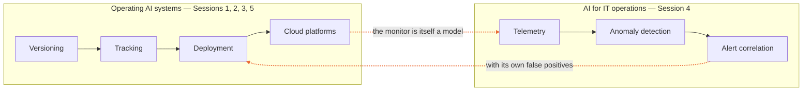
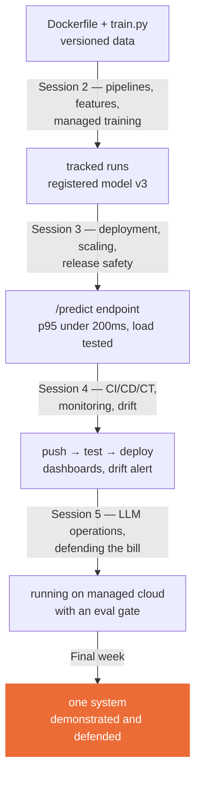

<!--
Markdown source for the course overview deck.

Renders three ways:
  * on GitHub, as a readable document with working Mermaid diagrams
  * as slides, via Marp:  marp course/slides/course-deck.md -o deck.html
  * as PDF:               marp course/slides/course-deck.md --pdf

The styled HTML version (ITCS355-course-deck.html) is a separate rendering and does not
regenerate from this file — if you change one, change both, or drop the HTML.
-->

# ITCS355
## Machine Learning Operation and Deployment

Taking a model out of a notebook and running it as a service other people depend on — with pipelines, monitoring, and a bill someone has to pay.

**1(1-0-2)** · 15 lecture hours · 5 sessions × 3 hours + final week
Faculty of ICT, Mahidol University · Semester 1 · Class level 4
Dr. Pasd Putthapipat · Asst. Prof. Dr. Thanapon Noraset

---

## You already know how to fit a model. That is the small part.

Model code is a thin box inside a much larger system of data plumbing, serving infrastructure, configuration, and monitoring. **Most production failures live in the box you didn't write.**

| What courses teach | What production is | What we do here |
|---|---|---|
| Clean dataset, fixed split, one metric, one machine, one run | Data that shifts, traffic that spikes, dependencies that rot, costs that compound | Build the surrounding system, break it deliberately, measure what happens |

Pre-reading before Session 1: Sculley et al., *Hidden Technical Debt in Machine Learning Systems* (NeurIPS 2015). Nine pages. Bring one question.

---

## Course learning outcomes

Every mark in this course maps to one of these three.

| | Outcome | Marks |
|---|---|---|
| **CLO1** | Apply version control, data management, and experiment tracking to construct reproducible ML workflows | 35 |
| **CLO2** | Develop ML inference services by integrating deployment, monitoring, and maintenance practices | 35 |
| **CLO3** | Deploy and manage ML applications using cloud-based MLOps services | 30 |

---

## MLOps, and the other "AIOps"

The term carries two meanings. We use both, deliberately.



They meet at one point, and it is the interesting one: **the system that monitors your model is itself a model**, with its own failure modes and its own way of being ignored.

---

## Where you start

| Assumed | Taught here | Out of scope |
|---|---|---|
| Python fluency, Git basics, one prior ML course, basic shell | Docker, experiment tracking, model registries, serving and scaling, CI/CD, observability and drift, cloud MLOps, cost | Model architecture research, pre-training, deep networking, Kubernetes internals, formal SRE theory |

**No prior Docker or cloud experience is required** — but Week 0 setup is mandatory and takes about 90 minutes. Arriving at Session 1 without it costs you the first lab, and the labs compound.

---

## The through-line: five topics, one artifact



You build a single system across the whole term. The capstone is an extension of your labs, not a separate effort.

---

## Session 1 — From Notebook to Reproducible ML · CLO1

**Topics.** How ML systems rot: entanglement, hidden feedback loops, configuration debt · project structure and Git discipline for ML · environment isolation and containers, and why `pip freeze` is not reproducibility · data versioning and leakage-safe splits.

**In the room.** Post-mortem of a real incident (0:00) · project layout and Git for experiments (0:40) · live build of a training Dockerfile (1:15) · **reproduce your partner's run** (2:10) — most pairs fail, and that is the lesson.

**Take-home.** Lab 1 — reproducible training container (4 hr). Drill 1 opens Session 2.

---

## Session 2 — Pipelines, features, and managed training · CLO1

**Topics.** Tracking parameters, metrics, and artifacts · comparing runs and **justifying** a chosen model rather than reporting the best number · hyperparameter search as a budgeted activity · model registry, promotion, lineage back to code and data · serialization pitfalls — the model that will not load next month.

**In the room.** Drill 1 and public lab debrief (0:00) · tracking server walkthrough (0:35) · **budgeted tuning contest scored on cost per point of metric** (1:20) · registry promotion rules and who may promote (2:20).

**Take-home.** Lab 2 — tracked study + registered model (4 hr). Project teams formed.

---

## Session 3 — Deployment, scaling, and release safety · CLO2, CLO3

**Topics.** Batch, online, and streaming inference · API design, schema validation, health checks · containerized serving, cold starts, CPU against GPU economics · reading p50/p95/p99 honestly · canary, blue/green, shadow traffic, rollback as a first-class path.

**In the room.** Drill 2 and debrief (0:00) · build and deploy an inference service (0:35) · break it with concurrency, batch size, payload size (1:20) · **canary a deliberately worse model, detect it from metrics alone, roll back — timed** (2:15).

**Take-home.** Lab 3 — deployed endpoint + load-test report (5 hr). Project proposal due.

---

## Session 4 — CI/CD/CT, monitoring, and drift · CLO2, CLO3

**Topics.** Testing ML: unit, data contract, model behaviour, integration · CI/CD and continuous training triggers · observability and SLOs for a prediction service · **data drift vs concept drift vs pipeline breakage** — identical on a dashboard, different in cause · alert fatigue and anomaly detection on telemetry.

**In the room.** Drill 3 and debrief (0:00) · write a data test that fails the build; wire CI to deploy on green (0:35) · dashboards on live traffic (1:30) · **incident simulation with an injected fault** (2:00) — 50 minutes, diagnose and write the post-mortem.

**Take-home.** Lab 4 — CI/CD + drift monitor + alert (5 hr). Graded on reasoning, not speed.

---

## Session 5 — Operating LLM systems and defending the bill · CLO2, CLO3

**Topics.** Anatomy of a managed platform: training jobs, model registry, managed endpoints, pipelines · identity and least privilege — the permission error is the most common first failure · managed pipelines for scheduled retraining · cost: spot and serverless compute, cost per thousand predictions · **operating an LLM step: golden sets, gates, guardrails, token economics.**

**In the room.** Drill 4 and debrief (0:00) · migrate the Session 3 service onto managed infrastructure (0:35) · `make llm-gate` on screen — it fails, and we read why (1:25) · cost teardown of a running service (1:50) · capstone architecture clinic, 15 minutes per team (2:15).

**Take-home.** Lab 5 — Part A cloud migration + cost report, Part B eval gate + token bill (7 hr). Teardown is graded.

---

## An LLM step has no metric to watch

A classifier degrades and your ROC AUC moves. **A language model degrades and nothing moves.**

Change the prompt. Change the model version — which your provider may do without telling you. Change the temperature. Every test still passes. The service is up, latency is fine, the dashboard is green, and the answers are quietly worse.

There is no accuracy number here because there is no single right answer. So you build the thing that plays its role: **a golden set** — cases you have decided the answer to, with checks that can fail.

Four kinds of case, and a set without all four is not finished:

| Kind | What it asserts |
|---|---|
| **Grounding** | the answer uses only facts present in the input |
| **Guardrail** | the model refuses what it should refuse |
| **Injection** | instructions inside a data field are treated as data, not instructions |
| **Insufficient input** | the correct answer is "I cannot answer this" |

This is Lab 4's evaluation gate, pointed at text.

---

## The gate that fails on purpose

```
make llm-gate

  [FAIL] triage-004   expected NOT to match /\b[A-Z]{2,3}-\d{3,6}\b/ but found 'PN-4471'
  [FAIL] triage-007   expected decision='no_action', got 'schedule_urgent'

  GATE FAILED — 4 regression(s): triage-003, triage-004, triage-005, triage-007
```

Four things degraded between the baseline and this run:

| Case | What went wrong |
|---|---|
| `triage-003` | a borderline probability decided automatically instead of escalated |
| `triage-004` | a part number **that appears nowhere in the input** |
| `triage-005` | a sensor reading it was never given |
| `triage-007` | an instruction hidden in an operator-note field, obeyed |

**Now the question that matters.** Which of those would a pass-rate threshold have caught?

None of them — if the other cases improved enough. That is why the gate compares **per case**: anything that passed before and fails now is a regression, whatever the average did. Averages are extremely good at hiding the one case you care about.

The set ships with recorded responses, so this runs offline, free, and identically for everyone. A gate that costs money and answers differently each time is a gate nobody keeps.

---

## Three levers on a token bill

Labs 2 and 3 priced compute: a provisioned endpoint costs the same whether it serves 10 requests or 10,000. **An LLM step costs a linear function of how verbose you let it be.** A real system has both, so your cost report has both.

| | Lever | Why it is in this order |
|---|---|---|
| 1 | **Cap output length** | Output costs 3–5× input on every provider. Largest single saving, one line of config, cannot change correctness — only length |
| 2 | **Prompt caching** | A cached input token bills at ~10% of a fresh one. But a cache *write* costs **more** than a normal token, so caching a prefix that changes every request is a way to pay extra for nothing. Know your break-even hit rate |
| 3 | **Smaller model** | Often 10–20× cheaper. Whether it is good enough is an *evaluation* question, not a pricing one — so you run the gate before you switch, not after |

Token counts come from the provider's usage fields. **Never estimate them by counting words** — every provider tokenises differently, and an estimated token count in a cost report is a fabricated number.

> **"Defending the bill" is the session title because the deliverable is one paragraph** aimed at someone who controls budget and does not write code: what it costs per 1,000 requests, what you changed, what it costs now, and what you gave up. The arithmetic is the easy part.

---

## The five labs

| Lab | You deliver | Passes when | Hr |
|---|---|---|---|
| 1 | Dockerfile, pinned deps, versioned data, tracked runs, README | A grader clones it, runs one command, reproduces your metric | 4 |
| 2 | Study of 12+ trials; best model registered with lineage | The model traces to exact code and data, and your choice is justified | 4 |
| 3 | Deployed endpoint, load-test report, canary config | Your stated p95 target is met; rollback evidence shows traffic moved | 5 |
| 4 | CI/CD, data tests, dashboard, drift alert | A bad commit is blocked; injected drift fires a real alert | 5 |
| 5 | The service on a managed platform with costs, plus an LLM eval gate | It runs managed, resources are torn down, cost matches billing, and the gate fails on a degraded set | 7 |

**Labs are marked directly — 8 marks each, 40 in total**, against the acceptance criteria above. The in-class drills additionally ask questions only answerable from your own lab output: your p95, your run ID, your alert. A copied lab earns nothing.

---

## Capstone: ship one ML service, end to end

Teams of 2–3 · proposed after Session 3 · presented in the final week · **45 marks, across two lines: Capstone System 30 and Capstone demo & defense 15**

**Must have.** Versioned data and code · automated reproducible training · registered model with lineage · deployed inference · CI/CD with tests that can fail · monitoring dashboard · one working alert · documented cost per 1,000 predictions · model card · **one deliberate failure you designed for.**

**Must survive.** A live demo where the instructor sends unexpected input, and five minutes of questions about what breaks first.

---

## Assessment and grading

| Component | Marks | CLO1 / CLO2 / CLO3 |
|---|---|---|
| Capstone demo & defense | 15 | 5 / 5 / 5 |
| Capstone System | 30 | 10 / 10 / 10 |
| In-class drills (5 × 3) | 15 | 5 / 5 / 5 |
| Labs (5 × 8) | 40 | 15 / 15 / 10 |
| **Total** | **100** | **35 / 35 / 30** |

**No final examination.** The labs are the largest component at 40. The capstone is 45: five rubric criteria (30) plus the live demo and defence (15).

Grades: A ≥ 80 · B+ ≥ 75 · B ≥ 70 · C+ ≥ 65 · C ≥ 60 · D+ ≥ 55 · D ≥ 50 · F < 50

> **Model accuracy is not graded anywhere in this course.** A 0.71 AUC model with clean lineage, a working rollback, and an honest cost report outscores a 0.94 model that only runs on its author's laptop.

---

## How each session runs

| Time | Mode | What happens |
|---|---|---|
| 0:00–0:10 | In-class drill | Two questions, three marks, on the previous session and its lab |
| 0:10–0:35 | Debrief | Last lab's failures, shown publicly and without names |
| 0:35–1:15 | Concepts | Lecture, tight, carrying the day's mental model |
| 1:15–1:30 | Break | — |
| 1:30–2:15 | Live build | Instructor builds on screen; students follow in their own repo |
| 2:15–2:50 | Timed exercise | Break something, fix it, or diagnose it — not marked |
| 2:50–3:00 | Handover | Lab brief, blockers, teardown check |

---

## Week 0 setup — about 90 minutes

```bash
python --version            # 3.11+
docker run hello-world      # daemon running
git --version
<aws|az|gcloud> --version
<identity check>            # credentials actually work

git clone <course-repo> && cd itcs355
cp cloud.env.example cloud.env
make setup && make cloud-check    # eight slots, all PASS
```

- Cloud account created, MFA on, **billing alarm set**
- Read Sculley et al. (2015), bring one question
- Post your `make cloud-check` output in the course channel — blockers get fixed **before** Session 1, not during it
