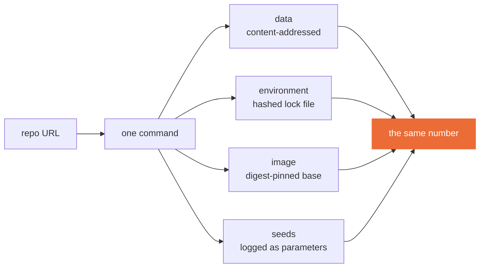

<!--
Teaching deck for Session 1. Renders three ways: on GitHub as a readable document,
as slides via `marp course/slides/session-01.md -o session-01.html`, and as PDF with
`--pdf`. Instructor notes are HTML comments — they do not render, but the raw file is
public, so nothing confidential goes in them.

Session 1 has NO drill and NO debrief: Drill 1 is at the start of Session 2 and there
is no previous lab to debrief. That frees the first 35 minutes, which this deck spends
on the cold open. Sessions 2-5 use the standard shape.

PREPARE BEFORE THIS SESSION: instructor/session-01-cold-open/ has the peer notebook, the
answer key, and spread.py for the debrief reveal. Hand the notebook out through the LMS —
do not link it in the course channel beforehand. Run spread.py once on the room machine.
-->

# Session 1
## From Notebook to Reproducible ML

**CLO1** · 3 hours · Take-home: Lab 1 (~4 hours)

Reading due today: Sculley et al., *Hidden Technical Debt in Machine Learning Systems* (2015)

---

## Today

| Time | What |
|---|---|
| 0:00–0:20 | Why this course exists |
| 0:20–0:50 | **Cold open — reproduce a stranger's result** |
| 0:50–1:15 | What reproducibility actually costs |
| 1:15–1:30 | Break |
| 1:30–2:15 | Live build — the training container |
| 2:15–2:50 | Data versioning and leakage-safe splits |
| 2:50–3:00 | Lab 1 handover |

From Session 2 onward we open with a 15-minute drill and a public debrief of the previous lab. Today there is nothing to debrief yet.

---

## The only claim this course makes

You already know how to train a model.

**Nobody is paid for a model.** They are paid for a service that keeps working when the data shifts, the traffic triples, the author leaves, and the bill arrives.

Everything in these five sessions is the distance between those two sentences.

---

## Cold open — 30 minutes, in pairs

You will be given a notebook and the number its author says it produces.

**Reproduce the number.** That is the whole task.

Rules: you may read anything, you may not message the author, and you stop at 25 minutes whether or not it worked.

<!--
Nobody reproduces it; ten honest runs land between 0.93 and 0.98, never twice the same.
Do not rescue anyone. Circulate and note WHICH fault each pair hits first — the next
slide lands harder when the categories come out of the room rather than off the screen.

Some pairs will get 0.961 and believe they succeeded. That is the most useful outcome
in the room, and the debrief takes it away from them.

Full answer key, timing and debrief script: instructor/session-01-cold-open/README.md
-->

---

## What broke

We will collect these on the board. Every failure lands in one of four places:

| | Link | Typical symptom |
|---|---|---|
| 1 | **Data** | a different file, or the same file split differently |
| 2 | **Environment** | a library minor version moved under you |
| 3 | **Code** | uncommitted change, or a path only on the author's machine |
| 4 | **Randomness** | a seed nobody set |

You just spent 25 minutes on what a grader will spend 5 minutes on with your Lab 1 repository. The difference is that they will not be trying to help you.

<!--
Run instructor/session-01-cold-open/spread.py --runs 10 on screen here. Ten runs, none
of them 0.965 — the author could not reproduce their own number either. They were never
lying; they simply never checked.

Then the last column: grouped split, ~0.76. Let the room find why. The label belongs to
the machine, the same machine sits on both sides of the split, and the model was
recognising machines rather than predicting failure.

Land it: the number was inflated by 0.20 before it was unstable by 0.04 — and every one
of you would have shipped it. Hold this back until after the four locks.
-->

---

## Hidden technical debt (Sculley et al., 2015)

The paper's argument in one line: **the model is the small part.**

> Only a tiny fraction of a real ML system is the ML code. Everything around it — configuration, data collection, feature extraction, serving infrastructure, monitoring — is where the cost lives.

Two forms of debt this course attacks directly:

- **Entanglement.** Change anything, change everything. There is no such thing as a local change to a model's inputs.
- **Configuration debt.** Config is code that nobody reviews, tests, or versions — and it is where reproducibility usually dies.

**Bring your one question.**

---

## Reproducibility is four locks, not a virtue



Any one of the four loose produces a different number, and the failure is silent. Lab 1 is the exercise of finding out which one is loose in your own repository.

---

## Git discipline for ML, briefly

Three rules, and they are not negotiable in this course:

1. **Data does not go in Git.** A pointer to data goes in Git. Git stores every version of a 300 MB file forever.
2. **Credentials never go in Git.** Not once, not in a deleted commit. `git log -p` outlives your embarrassment, and rotating a leaked key is your job, not the grader's.
3. **The commit SHA is part of your result.** A metric without a commit is an anecdote.

---

## Break — 15 minutes

Come back at the time on the screen. We build a container next, and it is easier to follow live than to catch up from the recording.

---

## Live build — the training container

Follow along in your own clone. I will go slowly at the two places people get stuck.

```bash
docker buildx build --platform linux/amd64 -t itcs355-lab1:dev .
make reproduce
```

Four decisions I will make out loud as I go:

- **Multi-stage**, so the final image does not ship a compiler
- **Non-root user**, because a training job has no reason to be root
- **`--platform linux/amd64`**, even though this laptop is arm64
- **No credentials in any layer** — they arrive at runtime

<!--
The platform flag catches about a third of every cohort. Show the failure deliberately if
time allows: build without it on Apple Silicon, then run the image on an amd64 host and
let them read `exec format error`. It lands far harder than saying it.
-->

---

## Pin the environment, properly

`pip freeze` is not reproducibility. It records what you happen to have installed, on your platform, today.

```bash
uv pip compile requirements.in --generate-hashes --universal \
  --python-version 3.11 -o requirements.txt
```

**Hashes turn a substituted package into a build failure instead of a silent change.**

Then pin the base image by digest, not by tag:

```
FROM python:3.11-slim@sha256:9534e5a8...
```

`python:3.11-slim` is a moving target. It is different bytes this month than last.

---

## Data versioning and leakage-safe splits

```bash
dvc init
dvc remote add -d storage ${BLOB_URI}/dvc
dvc add data/raw && dvc push
```

DVC keeps a hash in Git and the bytes in object storage. That is the whole idea.

**Then the split, and this is the part that actually costs marks.**

Our dataset has 240 machines with 25 readings each. A machine that runs hot reads hot in every row. Split row-wise and the model memorises the machine.

```python
GroupShuffleSplit(...)   # grouped by machine_id
```

`tests/test_data.py` asserts no `machine_id` appears in two splits. Lab 4 turns that assertion into a CI gate.

---

## Timed exercise — 20 minutes

Break your own split on purpose.

1. Change the split from grouped to row-wise
2. Re-run `make train` and write down the validation score
3. Run `make test` and read which assertion fails

**Then answer in one sentence:** the score went *up*. Why is that the bad outcome?

<!--
The score rises because the model can look up the machine. This is the single most
instructive 20 minutes in the course — students remember a number that improved when
their work got worse far longer than they remember a warning about leakage.
-->

---

## Lab 1 — handover

**[`labs/lab-01-reproducible-training.md`](../labs/lab-01-reproducible-training.md)** · 8 marks · due before Session 2

A grader with Docker and nothing else from your setup runs **one command** and compares the result against your claim.

Four graded decisions:

| Where | What |
|---|---|
| `requirements.txt` | regenerate with hashes |
| `Dockerfile` | pin the base by digest, add `--require-hashes` |
| `cloudlayer/<provider>.py` | implement `upload`, `download`, `push_image` |
| `README.md` | which pinning would you drop first, and why |

**Setup not working?** Post your `make cloud-check` output — including failures. Both setup guides are in `course/`: GCP and Azure. Pick one, stay on it.

---

## Before Session 2

- [ ] Lab 1 pushed and reproducing from a **fresh clone**
- [ ] Reading: Google Cloud, *MLOps: Continuous delivery and automation pipelines in ML*
- [ ] Drill 1 opens Session 2 — two questions, 3 marks, and one of them can only be answered from your own Lab 1

Bring the thing that broke. Someone else has the same problem and has not said so.
