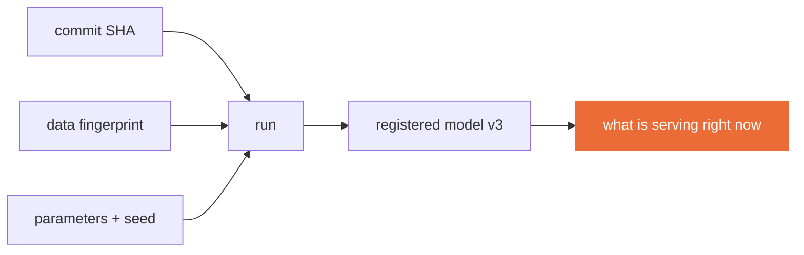

<!--
Teaching deck for Session 2. Standard session shape: drill, debrief, concepts, break,
live build, timed exercise, handover. Drill 1 questions live in the private instructor
repository — do not paste them into this file, it is public.
-->

# Session 2
## Pipelines, features, and managed training

**CLO1** · 3 hours · Take-home: Lab 2 (~4 hours)

Reading due today: Google Cloud, *MLOps: Continuous delivery and automation pipelines in ML*

---

## Today

| Time | What |
|---|---|
| 0:00–0:10 | **Drill 1** — 2 questions, 3 marks |
| 0:10–0:35 | Lab 1 debrief, in public, without names |
| 0:35–1:15 | Tracking, registries, lineage |
| 1:15–1:30 | Break |
| 1:30–2:15 | Live build — the tracking server, and a budgeted tuning contest |
| 2:15–2:50 | Promotion rules, and one run as a managed job |
| 2:50–3:00 | Lab 2 handover |

---

## Drill 1 — 10 minutes

Two questions, three marks. One concept question from Session 1, and one worth a mark that only **your own** Lab 1 submission can answer.

You may open your repository. You may not open anyone else's.

<!--
Evidence questions come from each student's own submission, prepared in advance — their
data fingerprint, their five runs' parameter spread, their answer to the trade-off
question, their stated tolerance. That is what makes a borrowed repo worthless here.
-->

---

## Lab 1 debrief — 20 minutes

Failures shown on screen, anonymised. This block gets cut when we run late, and cutting it is a mistake.

What we will look at:

- The `exec format error` — built on arm64, run on amd64
- A tolerance of ±0.1 on a metric of 0.85
- A `make reproduce` that needed an undocumented environment variable
- Something that worked here and nowhere else

**Normalising broken builds is most of the cultural content of this subject.** Nobody in industry ships without breaking things; they just have a system that catches it.

---

## Tracking is not logging

A log line is for a human reading it once. A tracked run is a **row you can query later**.

Every run in this course records five things:

| | What | Why it matters in week 9 |
|---|---|---|
| 1 | Parameters, including the seed | "what did I actually change?" |
| 2 | Metrics, validation **and** test separately | selecting on test is cheating, quietly |
| 3 | Data version | the fingerprint the run consumed |
| 4 | Git commit SHA | the code that produced it |
| 5 | The model artifact | the thing you would ship |

Miss any one and the run becomes an anecdote you cannot defend in a review.

---

## Validation and test are different questions

Validation answers **"which of my candidates is best?"**
Test answers **"how good is the one I picked?"**

Use test to choose and you have no honest estimate left. You have simply fitted the test set with a slower loop.

In this course you will report both, always, and we will notice when they are suspiciously close.

---

## Lineage: the question you get asked during an incident

Something is wrong in production at 02:00. The question is never "what is the F1?"

The question is:

> **Which code, which data, and which parameters produced the thing that is currently serving?**



A registry entry that cannot answer that is decoration.

---

## Break — 15 minutes

---

## Live build — tracking server, then a contest

```bash
make tune        # budgeted hyperparameter study
make compare     # rank runs by metric, and by cost per point
```

**The contest, 20 minutes, in pairs.** You have a fixed budget of trials. The winner is not the best metric.

**The winner is the best metric per unit of compute spent.**

<!--
Announce the scoring rule BEFORE they start, or they optimise the wrong thing and feel
cheated. Students find this genuinely disorienting, which is the point — it is the first
time in their degree that the cheaper answer wins. Expect at least one team to argue.
That argument is the lesson; let it run for two minutes.
-->

---

## Why cost per point, and not the metric

Because that is the question you will actually be asked.

Nobody with a budget asks "can you get another 0.4 points?" They ask **"what will another 0.4 points cost, and what else could that buy?"**

A model that is 0.3 points worse and trains in a fifth of the time is usually the better engineering decision, and you should be able to say so out loud with numbers behind it.

Lab 2 makes you justify your choice. "It scored highest" is not a justification.

---

## Promotion is a rule, not a feeling

A registry with everything in it is a folder.

Write the rule down before you need it:

- **What must be true** to move a model from staging to production
- **Who** may do it
- **What the rollback is**, and how long it takes

Then Lab 4 turns your rule into a CI gate that can actually block a bad model. If your rule cannot be expressed as a check, it is not a rule.

---

## Feature reuse and training/serving skew

The classic production failure, and it is boring:

> The feature was computed one way in training and a slightly different way at serving. Nobody noticed for six weeks.

Guards that work:

- Compute the feature in **one** place, imported by both paths
- Assert the schema at the service boundary, not just in training
- Log a sample of live feature values and compare them against training

`service/schemas.py` does the second one. Lab 3 makes you break it on purpose.

---

## Timed exercise — 25 minutes

Submit **one** training run as a managed job on your provider, rather than on your laptop.

```bash
make image-push          # the image your job will run
```

Then answer two questions in writing:

1. What did the managed job need that your laptop did not?
2. What would it cost to run that job 100 times?

<!--
Almost everyone hits a permissions error here, which is the intended experience and the
bridge into Session 5. Pre-create roles if the room is short on time; otherwise let the
first failure happen and read the error together.
-->

---

## Lab 2 — handover

**[`labs/lab-02-tracking-and-registry.md`](../labs/lab-02-tracking-and-registry.md)** · 8 marks · due before Session 3

A study of **at least 12 trials**, the best model registered with lineage back to commit and data version, and a written justification of your choice.

Passes when: the registered model traces to exact code and data, and your run comparison justifies the model you picked.

**Not five seeds of the same configuration.** Vary something that changes behaviour.

---

## Before Session 3

- [ ] Lab 2 pushed, 12+ trials tracked, best model registered
- [ ] Your promotion rule written down in your README
- [ ] Drill 2 opens Session 3

Capstone: **teams of 2–3 formed by the end of today**, problem area chosen. The proposal is due end of Session 3, and unapproved scope is the main cause of failed capstones.
