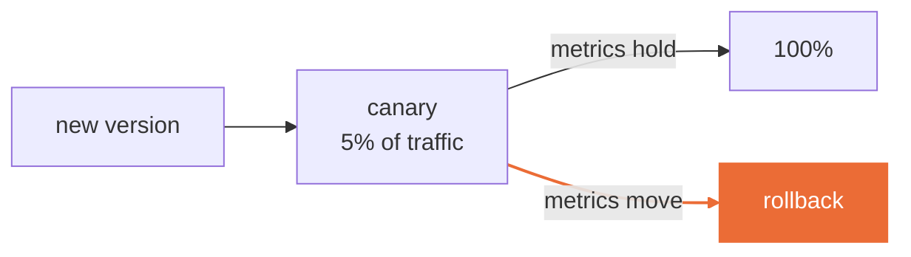

<!--
Teaching deck for Session 3. The timed rollback drill at 2:15 is the highest-value block;
protect it when running late by cutting the autoscaling slide, not the drill.
-->

# Session 3
## Deployment, scaling, and release safety

**CLO2 · CLO3** · 3 hours · Take-home: Lab 3 (~5 hours)

---

## Today

| Time | What |
|---|---|
| 0:00–0:10 | **Drill 2** — 2 questions, 3 marks |
| 0:10–0:35 | Lab 2 debrief |
| 0:35–1:15 | Serving patterns, latency, release safety |
| 1:15–1:30 | Break |
| 1:30–2:15 | Live build — deploy an endpoint, then break it |
| 2:15–2:50 | **Timed rollback drill** |
| 2:50–3:00 | Lab 3 handover · capstone proposals due end of today |

---

## Three ways to serve, and how to choose

| | Pattern | Choose it when |
|---|---|---|
| **Batch** | score on a schedule, write results | freshness measured in hours; cheapest by far |
| **Online** | request in, prediction out | a user or system is waiting |
| **Streaming** | score events as they arrive | continuous input, order matters |

**Start by asking how fresh the answer must be.** Most systems that were built online should have been batch, and the reason they were not is that online felt more impressive.

Batch has no cold start, no autoscaling, no p99, and no 3am page.

---

## Report p95, not the mean

The mean latency of a service tells you almost nothing, and it flatters you.

```
mean  120ms      p95   890ms      p99  2,400ms
```

That service feels broken to 1 request in 20, and the mean says it is fine.

**A latency number without a percentile and a concurrency level is not a number.** In Lab 3 you state both, or the result does not count.

---

## The four things that make p99 ugly

| | Cause | Where it bites |
|---|---|---|
| 1 | **Cold start** | scale-to-zero services — your first request after idle |
| 2 | **Queueing** | concurrency above what the instance can serve |
| 3 | **Payload size** | a batch endpoint called with one huge request |
| 4 | **The model itself** | more trees, deeper, bigger input |

Only the fourth is a modelling problem. Three of the four are operations, and they are the three that will actually page you.

---

## Release patterns



**Canary** — a small share of real traffic, watched.
**Blue/green** — two full environments, switch, switch back.

The pattern matters less than the answer to one question:

> **How long, in seconds, from "this is wrong" to "traffic has moved"?**

If you do not know, you do not have a rollback. You have an intention.

---

## Break — 15 minutes

---

## Live build — deploy, then break it

```bash
make serve          # locally, on :8080
make serve-image    # the container the grader will run
make loadtest       # three concurrency levels
```

Then we break it, deliberately, three ways:

1. **Concurrency** — push past what one instance serves
2. **Payload size** — one enormous request
3. **Schema** — a field that is a string where the model expects a number

Watch which failures return a clean 4xx and which return a 500 with a stack trace. The second kind is a bug in your service, not in the caller.

---

## Timed rollback drill — 35 minutes

I deploy a bad model to your endpoint. You get it back.

**The clock starts when you notice, not when I deploy.**

Record three numbers:

| | Number |
|---|---|
| 1 | Seconds from deploy to **detection** |
| 2 | Seconds from detection to **traffic moved** |
| 3 | How many predictions the bad model served |

<!--
The drill works best if the canary model is only SLIGHTLY worse — an obviously broken
model teaches nothing about detection, which is the hard half. Prepare a model with a
plausible but degraded threshold.

Most teams discover their detection time is the large number and their rollback time is
the small one. That is the lesson: the rollback was never the bottleneck.
-->

---

## What that drill just taught you

Almost everyone finds the same thing: **rollback was fast, detection was slow.**

Teams spend their effort on deployment automation and almost none on knowing something is wrong. That imbalance is exactly what Session 4 is about.

The third number — predictions served by the bad model — is the one you will be asked about in an incident review. It is a business number, not an engineering one.

---

## Lab 3 — handover

**[`labs/lab-03-serving-and-rollback.md`](../labs/lab-03-serving-and-rollback.md)** · 8 marks · due before Session 4

A deployed inference endpoint, a load-test report at **three** concurrency levels, and a canary or blue/green configuration.

Passes when: your stated p95 target is met at your stated concurrency, and your rollback evidence shows **traffic actually moved** — not that a config file exists.

Teardown is graded. Cold endpoints still bill.

---

## Before Session 4

- [ ] Lab 3 pushed, with the load-test report and rollback evidence
- [ ] Reading: Breck et al., *The ML Test Score* (2017)
- [ ] Recommended: the SLO and post-mortem chapters of *Site Reliability Engineering*
- [ ] Drill 3 opens Session 4

**Capstone proposal due end of today.** One page: problem, dataset and licence, latency and freshness needs, serving pattern, planned failure mode, cost estimate. Approval is required before you build.
