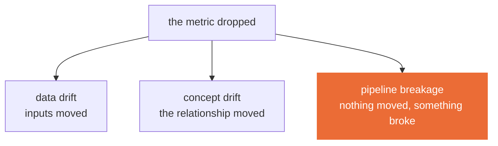

<!--
Teaching deck for Session 4. The 50-minute incident simulation is the highest-value block
in the whole course. Budget the full time; it always runs long. Prepare three fault
variants so adjacent teams cannot copy.
-->

# Session 4
## CI/CD/CT, monitoring, and drift

**CLO2 · CLO3** · 3 hours · Take-home: Lab 4 (~5 hours)

Reading due today: Breck et al., *The ML Test Score* (2017)

---

## Today

| Time | What |
|---|---|
| 0:00–0:10 | **Drill 3** — 2 questions, 3 marks |
| 0:10–0:35 | Lab 3 debrief |
| 0:35–1:15 | Testing ML, drift, and what an alert is for |
| 1:15–1:30 | Break |
| 1:30–2:00 | Live build — a data test that fails the build |
| 2:00–2:50 | **Incident simulation** |
| 2:50–3:00 | Lab 4 handover |

---

## Testing ML: three kinds, three jobs

| | Kind | Fails when | Runs |
|---|---|---|---|
| **Unit** | your code is wrong | a function misbehaves | every commit |
| **Data contract** | your *input* is wrong | schema, ranges, nulls, leakage | every commit **and** every batch |
| **Model behaviour** | your *model* is wrong | a known case gets a wrong answer | every commit |

The second and third do not exist in ordinary software, and they are where ML systems actually fail.

`tests/test_data.py` and `tests/test_model_behaviour.py` are yours to extend.

---

## A test that has never failed has not been tested

Write the test. Then **break the thing on purpose** and watch it go red.

An assertion that has only ever been green is a comment with a longer runtime.

This is the single habit that separates Lab 4 from a checkbox exercise, and it is graded: your CI must demonstrably block a deliberately bad commit.

---

## Three things that look identical from the outside



**Data drift** — retrain, probably.
**Concept drift** — retrain will not save you; the world changed and the label means something new.
**Pipeline breakage** — retraining on broken input makes it permanently worse.

**Check the third one first.** It is the most common and the only one where acting on the obvious diagnosis causes harm.

---

## An SLO is a decision you make in advance

An alert exists to make someone do something. If nobody acts, delete it.

Before you write one, answer:

- **What is the objective?** p95 under 300ms, 99% of the week.
- **What is the budget?** how much failure is acceptable before you stop shipping features.
- **What is the action?** page a human, roll back automatically, or open a ticket for Monday.

An alert with no action attached is how alert fatigue starts, and alert fatigue is how the real page gets missed.

---

## Break — 15 minutes

---

## Live build — a test that fails the build

```bash
make test                 # green
make inject-drift         # shift a feature's distribution, deliberately
make drift                # score it against the reference window
```

Then we wire it: push, tests run, deploy happens **only** on green.

```
push → lint → data tests → model tests → build → deploy
```

Cheap checks first. A schema mistake should fail in 30 seconds, not after a container build.

---

## Incident simulation — 50 minutes

I inject a fault into your system. You do not know which one.

Your team produces **four things**:

| | Deliverable |
|---|---|
| 1 | Which of the three it was — drift, concept change, or breakage |
| 2 | The evidence you used to decide |
| 3 | The decision: retrain, roll back, or neither |
| 4 | A five-line post-mortem, blameless |

**Scored on the reasoning, not the speed.** A team that reaches the wrong conclusion with clean evidence does better than one that guesses correctly.

<!--
Prepare three fault variants so adjacent teams cannot copy: a shifted feature
distribution, a schema change, and a latency regression. Template for the post-mortem is
docs/postmortem-template.md.

This block always runs long. Protect it. If you must cut something today, cut the SLO
slide, not this.
-->

---

## The post-mortem rule

**Blameless.** Not politeness — accuracy.

The moment a post-mortem can end with a person's name, people stop reporting the near-misses, and near-misses are the cheapest information you will ever get about your system.

Write what the system allowed to happen, and what would have caught it.

---

## Lab 4 — handover

**[`labs/lab-04-cicd-monitoring-drift.md`](../labs/lab-04-cicd-monitoring-drift.md)** · 8 marks · due before Session 5

CI/CD with data-contract and model-behaviour tests, a dashboard, a scheduled drift detector, and **one working alert**.

Passes when: a deliberately bad commit is **blocked**, and an injected distribution shift fires a **real alert**, with a written post-mortem.

Not "a workflow file exists." A bad commit that gets stopped, and an alert that actually arrived somewhere.

---

## Before Session 5

- [ ] Lab 4 pushed — blocked commit and fired alert both evidenced
- [ ] Post-mortem written
- [ ] Drill 4 opens Session 5

**Capstone architecture review is next session** — 15 minutes per team, in the room. Teams that have not had their design questioned before the final week tend to submit incomplete monitoring. Bring your pipeline, serving, and monitoring design.
